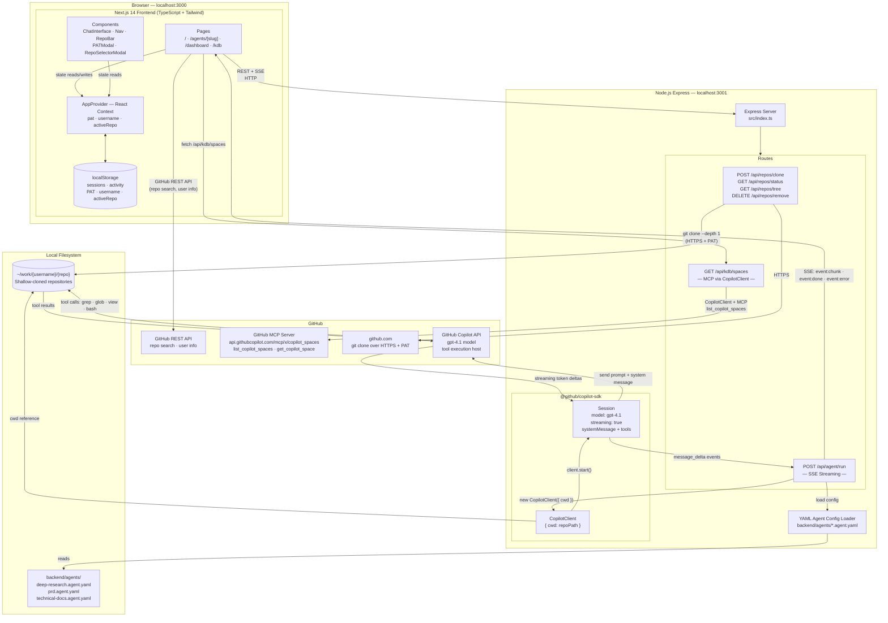
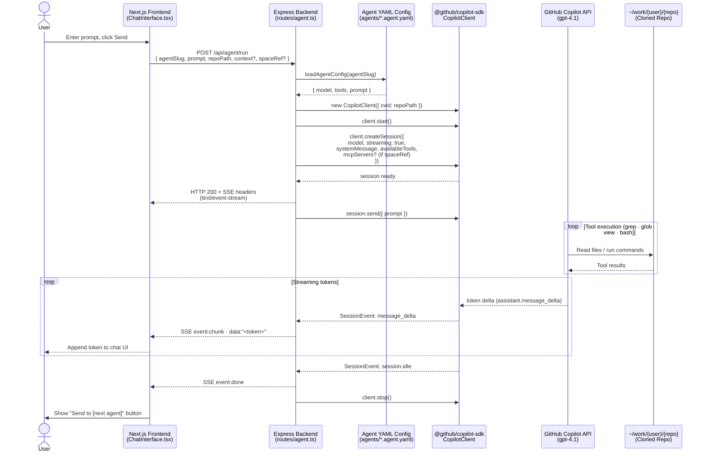
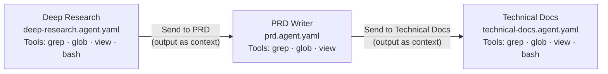

# Architecture

This document describes the system architecture of **Web-Spec** — how the frontend, backend, GitHub Copilot SDK, and external services interact.

---

## System Overview

---

## Agent Run — Sequence Diagram

This diagram shows the exact sequence of calls when a user submits a prompt to an agent.

---

## Agent Pipeline

Agents are chained — the output of one session can be forwarded as `context` to the next agent's system prompt.

All agents use model `gpt-4.1` and run with `cwd` set to the cloned repository, giving them full filesystem access via their declared tools.

---

## Component Responsibilities

| Layer | Technology | Responsibility |
|-------|-----------|----------------|
| Frontend pages | Next.js 14 App Router | Routing, SSE consumption, UI rendering |
| Frontend state | React Context + localStorage | PAT, username, active repo, sessions, activity log |
| Backend server | Express 4 + TypeScript | HTTP routing, CORS, request validation |
| Repo management | `child_process.execSync` + `git` | Shallow clone, file tree, removal |
| Agent execution | `@github/copilot-sdk` `CopilotClient` | Session lifecycle, prompt dispatch, tool delegation, MCP server integration |
| SSE proxy | Next.js Route Handler (`app/api/agent/run/route.ts`) | Bypasses rewrite-proxy buffering; pipes backend `ReadableStream` directly to client |
| Streaming transport | Server-Sent Events (SSE) | Token-by-token delivery from Copilot API to browser |
| Agent config | YAML files (`agents/*.agent.yaml`) | Model, tools, system prompt per agent |
| Model backend | GitHub Copilot API (gpt-4.1) | LLM inference + tool call execution against the repo |

---

## Data Flow Summary

1. **User** enters a GitHub PAT and selects a repository in the frontend.
2. **Frontend** calls `POST /api/repos/clone` → backend runs `git clone --depth 1` into `~/work/{username}/{repo}`.
3. **User** picks an agent and submits a prompt.
4. **Frontend** opens an SSE connection via `POST /api/agent/run`.
5. **Backend** reads the agent's YAML config, instantiates a `CopilotClient` with `cwd` pointing to the cloned repo, and creates a streaming session.
6. **GitHub Copilot API** receives the system prompt + user message, executes tool calls (`grep`, `glob`, `view`, `bash`) directly against the repo filesystem, and streams tokens back.
7. **Backend** forwards each `message_delta` event as an SSE `chunk` event.
8. **Frontend** renders tokens in real time. On completion, a "Send to [next agent]" button appears, passing the full response as `context` to the next agent in the chain.

---

## Copilot Spaces via MCP

The Knowledge Base page lists the user's Copilot Spaces by creating a short-lived `CopilotClient` session configured with the `copilot_spaces` MCP server (`https://api.githubcopilot.com/mcp/x/copilot_spaces`). The session prompts the LLM to call `list_copilot_spaces` and return structured JSON. This takes 10-30 seconds due to the LLM round-trip.

When a user selects a space, the `spaceRef` (`owner/name`) is stored in `localStorage` and included in subsequent `POST /api/agent/run` requests. The backend conditionally attaches the `copilot_spaces` MCP server to the agent session and appends a system prompt instruction to call `get_copilot_space`, giving the agent access to the curated space context.

MCP permission requests (`kind: "mcp"`) are auto-approved in both the KDB listing and agent sessions. Non-MCP permission requests are denied by rules.
