# Architecture

This document describes the system architecture of **Web-Spec** — how the frontend, backend, GitHub Copilot SDK, and external services interact.

---

## System Overview

The system has three layers: a **browser-based frontend**, a **stateless backend**, and **GitHub's cloud services**. The backend bridges the frontend to the Copilot SDK and the local filesystem — it holds no persistent state of its own.

```mermaid
flowchart TD
    Browser["🖥 Next.js Frontend\nlocalhost:3000\nPages · Components · React Context · localStorage"]
    Backend["⚙️ Express Backend\nlocalhost:3001\nREST + SSE routes · Copilot SDK · YAML agent configs"]
    Disk[("💾 Local Filesystem\n~/work/{user}/{repo}\nShallow-cloned repos + agent YAML files")]
    GitHub["☁️ GitHub Services\nREST API · Copilot API · MCP Server · Git remotes"]

    Browser -- "REST + SSE\n(PAT in Authorization header)" --> Backend
    Browser -- "GitHub REST API\n(repo search, user info)" --> GitHub
    Backend -- "git clone / file tree" --> Disk
    Backend -- "Copilot SDK sessions\n(streaming + tool calls)" --> GitHub
    GitHub -- "tool execution\n(grep · glob · view · bash)" --> Disk
```

### Frontend Internals

The Next.js 14 App Router frontend manages all user-facing state in React Context backed by `localStorage` — no server-side persistence.

```mermaid
flowchart TD
    subgraph Browser["Browser — localhost:3000"]
        Pages["Pages\n/ · /agents/[slug] · /dashboard · /kdb · /admin"]
        Components["Components\nChatInterface · SpaceSelector · Nav\nRepoBar · PATModal · RepoSelectorModal · ActionPanel"]
        AppCtx["AppProvider — React Context\npat · username · activeRepo"]
        LS[("localStorage\nsessions · activity\nPAT · username · activeRepo")]
    end

    Pages -- state reads/writes --> AppCtx
    AppCtx <--> LS
    Components -- state reads --> AppCtx
```

### Backend Internals

The Express backend exposes four route groups behind a single server. Agent execution uses the `@github/copilot-sdk` to create streaming sessions against cloned repos.

```mermaid
flowchart TD
    Express["Express Server\nsrc/index.ts"]

    subgraph Routes["Route Groups"]
        ReposRoute["Repos API\nPOST /api/repos/clone\nGET  /api/repos/status\nGET  /api/repos/tree\nDELETE /api/repos/remove"]
        AgentRoute["Agent API\nPOST /api/agent/run\n— SSE Streaming —"]
        KdbRoute["KDB API\nGET /api/kdb/spaces\n— MCP via CopilotClient —"]
        AdminRoute["Admin API\nGET /api/admin/agents\nGET /api/admin/agents/:slug\nPUT /api/admin/agents/:slug"]
    end

    YAMLLoader["YAML Agent Config Loader\nbackend/agents/*.agent.yaml"]

    subgraph CopilotSDK["@github/copilot-sdk"]
        CopilotClient["CopilotClient\n{ cwd: repoPath }"]
        Session["Session\nmodel · streaming: true\nsystemMessage + tools"]
    end

    Express --> Routes
    AgentRoute -- "load config" --> YAMLLoader
    AgentRoute -- "new CopilotClient({ cwd })" --> CopilotClient
    CopilotClient -- "client.start()" --> Session
```

### External Services

The backend and frontend each communicate with GitHub services directly — the frontend for REST API calls (repo search, user info) and the backend for Copilot SDK sessions, git operations, and MCP-based Copilot Spaces access.

---

## Agent Run — Sequence Diagram

This diagram shows the exact sequence of calls when a user submits a prompt to an agent.

---

## Agent Pipeline

Agents are chained — the output of one session can be forwarded as `context` to the next agent's system prompt.

```mermaid
flowchart LR
    DR["Deep Research\ndeep-research.agent.yaml\nTools: grep · glob · view · bash"]
    PRD["PRD Writer\nprd.agent.yaml\nTools: grep · glob · view"]
    TD["Technical Docs\ntechnical-docs.agent.yaml\nTools: grep · glob · view · bash"]
    SW["Spec Writer\nspec-writer.agent.yaml\nTools: bash"]
    IC["Issue Creator\nissue-creator.agent.yaml\nTools: bash"]

    DR -- "Send to PRD\n(output as context)" --> PRD
    PRD -- "Send to Technical Docs\n(output as context)" --> TD
    TD -. "Create Docs on Repo\n(output as context)" .-> SW
    TD -. "Create GitHub Issues\n(output as context)" .-> IC
```

All agents use model `gpt-4.1` (except `technical-docs` which uses `o4-mini`) and run with `cwd` set to the cloned repository. The `spec-writer` and `issue-creator` are action agents triggered by post-action buttons on the Technical Docs page — they receive the tech-docs output as `context` and use `bash` to create branches/files or GitHub issues via `gh` CLI.

---

## Component Responsibilities

| Layer | Technology | Responsibility |
|-------|-----------|----------------|
| Frontend pages | Next.js 14 App Router | Routing, SSE consumption, UI rendering |
| Frontend state | React Context + localStorage | PAT, username, active repo, sessions, activity log |
| Admin page | `/admin` client component | View/edit agent YAML configs (displayName, description, model, tools, prompt) via REST API |
| Action panel | `ActionPanel` modal component | Stream action agent output (spec-writer, issue-creator) in a modal overlay |
| Backend server | Express 4 + TypeScript | HTTP routing, CORS, request validation |
| Admin API | `routes/admin.ts` | GET/PUT endpoints for reading and writing agent YAML files on disk |
| Repo management | `child_process.execSync` + `git` | Shallow clone, file tree, removal |
| Agent execution | `@github/copilot-sdk` `CopilotClient` | Session lifecycle, prompt dispatch, tool delegation, MCP server integration |
| SSE proxy | Next.js Route Handler (`app/api/agent/run/route.ts`) | Bypasses rewrite-proxy buffering; pipes backend `ReadableStream` directly to client |
| Streaming transport | Server-Sent Events (SSE) | Token-by-token delivery from Copilot API to browser |
| Agent config | YAML files (`agents/*.agent.yaml`) + shared `agentFileMap.ts` | Model, tools, system prompt per agent |
| Model backend | GitHub Copilot API (gpt-4.1) | LLM inference + tool call execution against the repo |

---

## Data Flow Summary

1. **User** enters a GitHub PAT and selects a repository in the frontend.
2. **Frontend** calls `POST /api/repos/clone` → backend runs `git clone --depth 1` into `~/work/{username}/{repo}`.
3. **User** picks an agent and submits a prompt.
4. **Frontend** opens an SSE connection via `POST /api/agent/run`.
5. **Backend** reads the agent's YAML config, instantiates a `CopilotClient` with `cwd` pointing to the cloned repo, and creates a streaming session.
6. **GitHub Copilot API** receives the system prompt + user message, executes tool calls (`grep`, `glob`, `view`, `bash`) directly against the repo filesystem, and streams tokens back.
7. **Backend** forwards each `message_delta` event as an SSE `chunk` event.
8. **Frontend** renders tokens in real time. On completion, a "Send to [next agent]" button appears, passing the full response as `context` to the next agent in the chain.

---

## Copilot Spaces via MCP

The Knowledge Base page lists the user's Copilot Spaces by creating a short-lived `CopilotClient` session configured with the GitHub MCP server (`https://api.githubcopilot.com/mcp/readonly`) and the `copilot_spaces` toolset (via the `X-MCP-Toolsets` header). The environment variables `COPILOT_MCP_COPILOT_SPACES_ENABLED=true` and `GITHUB_PERSONAL_ACCESS_TOKEN` must be set on the CopilotClient's env to enable the built-in MCP space tools (`github-list_copilot_spaces`, `github-get_copilot_space`). This takes 10-30 seconds due to the LLM round-trip.

Users can select one or more Copilot Spaces directly from the chat input area using the `SpaceSelector` component. The selected space references (`owner/name` strings) are passed as `spaceRefs: string[]` in `POST /api/agent/run` requests. The backend conditionally attaches the `copilot_spaces` MCP server to the agent session and appends a system prompt instruction listing all selected spaces, instructing the agent to call `get_copilot_space` for each one. The legacy single `spaceRef` parameter is still accepted for backward compatibility and normalized into the array internally.

MCP permission requests (`kind: "mcp"`) are auto-approved in both the KDB listing and agent sessions. Non-MCP permission requests are denied by rules.
